## 柱状图和条形图

### 基础条形图

```html
<html lang="en">
<head>
    <meta charset="UTF-8">
    <title>基础条形图</title>

    <script src="./js/highcharts.js"></script>
    <script src="./js/exporting.js"></script>
    <script src="./js/series-label.js"></script>
    <script src="./js/zh_cn.js"></script>

</head>

<style>
    #container {
        width: 70vw;
        height: 70vh;
        position: absolute;
        top: 50%;
        left: 50%;
        transform: translate(-50%, -50%);
    }
</style>
<body>
<div id="container"></div>
<script>
    var chart = Highcharts.chart('container', {
        chart: {
            type: 'bar'
        },
        title: {
            text: '各洲不同时间的人口条形图'
        },
        subtitle: {
            text: '数据来源: Wikipedia.org'
        },
        xAxis: {
            categories: ['非洲', '美洲', '亚洲', '欧洲', '大洋洲'],
            title: {
                text: null
            }
        },
        yAxis: {
            min: 0,
            title: {
                text: '人口总量 (百万)',
                align: 'high'
            },
            labels: {
                overflow: 'justify'
            }
        },
        tooltip: {
            valueSuffix: ' 百万'
        },
        plotOptions: {
            bar: {
                dataLabels: {
                    enabled: true,
                    allowOverlap: true // 允许数据标签重叠
                }
            }
        },
        legend: {
            layout: 'vertical',
            align: 'right',
            verticalAlign: 'top',
            x: -40,
            y: 100,
            floating: true,
            borderWidth: 1,
            backgroundColor: ((Highcharts.theme && Highcharts.theme.legendBackgroundColor) || '#FFFFFF'),
            shadow: true
        },
        series: [{
            name: '1800 年',
            data: [107, 31, 635, 203, 2]
        }, {
            name: '1900 年',
            data: [133, 156, 947, 408, 6]
        }, {
            name: '2008 年',
            data: [973, 914, 4054, 732, 34]
        }]
    });
</script>

</body>
</html>
```


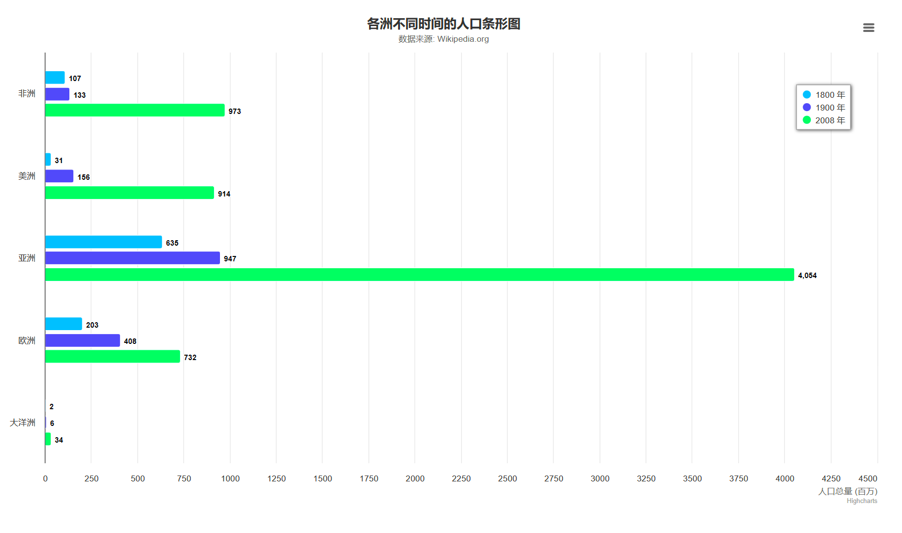


### 堆叠条形图

```html
<html lang="en">
<head>
    <meta charset="UTF-8">
    <title>堆叠条形图</title>

    <script src="./js/highcharts.js"></script>
    <script src="./js/exporting.js"></script>
    <script src="./js/series-label.js"></script>
    <script src="./js/zh_cn.js"></script>

</head>

<style>
    #container {
        width: 70vw;
        height: 70vh;
        position: absolute;
        top: 50%;
        left: 50%;
        transform: translate(-50%, -50%);
    }
</style>
<body>
<div id="container"></div>
<script>
    var chart = Highcharts.chart('container', {
        chart: {
            type: 'bar'
        },
        title: {
            text: '堆叠条形图'
        },
        xAxis: {
            categories: ['苹果', '橘子', '梨', '葡萄', '香蕉']
        },
        yAxis: {
            min: 0,
            title: {
                text: '水果消费总量'
            }
        },
        legend: {
            /* 图例显示顺序反转
             * 这是因为堆叠的顺序默认是反转的，可以设置
             * yAxis.reversedStacks = false 来达到类似的效果
             */
            reversed: true
        },
        plotOptions: {
            series: {
                stacking: 'normal'
            }
        },
        series: [{
            name: '小张',
            data: [5, 3, 4, 7, 2]
        }, {
            name: '小彭',
            data: [2, 2, 3, 2, 1]
        }, {
            name: '小潘',
            data: [3, 4, 4, 2, 5]
        }]
    });
</script>

</body>
</html>
```


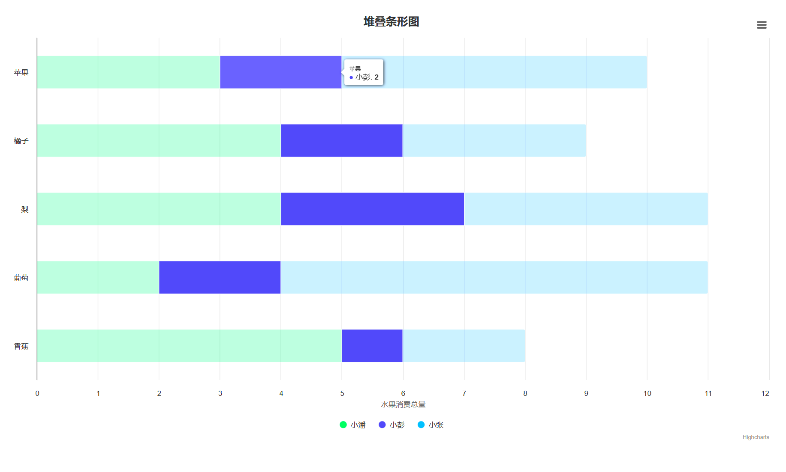


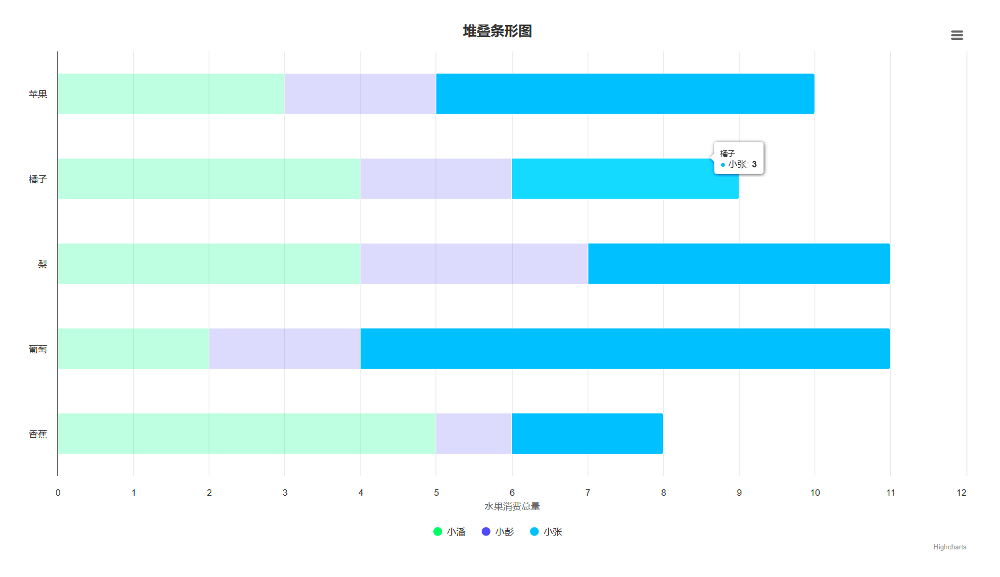


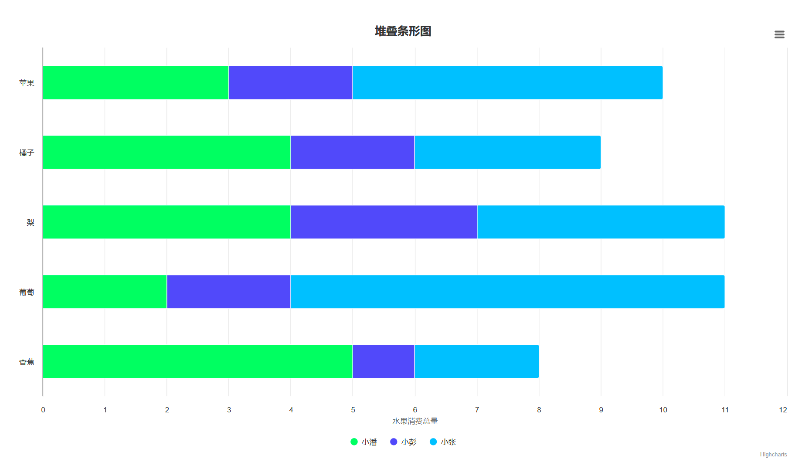


### 基础柱状图

```html
<html lang="en">
<head>
    <meta charset="UTF-8">
    <title>基础柱状图</title>

    <script src="./js/highcharts.js"></script>
    <script src="./js/exporting.js"></script>
    <script src="./js/series-label.js"></script>
    <script src="./js/zh_cn.js"></script>

</head>

<style>
    #container {
        width: 70vw;
        height: 70vh;
        position: absolute;
        top: 50%;
        left: 50%;
        transform: translate(-50%, -50%);
    }
</style>
<body>
<div id="container"></div>
<script>
    var chart = Highcharts.chart('container', {
        chart: {
            type: 'column'
        },
        title: {
            text: '月平均降雨量'
        },
        subtitle: {
            text: '数据来源: WorldClimate.com'
        },
        xAxis: {
            categories: [
                '一月', '二月', '三月', '四月', '五月', '六月', '七月', '八月', '九月', '十月', '十一月', '十二月'
            ],
            crosshair: true
        },
        yAxis: {
            min: 0,
            title: {
                text: '降雨量 (mm)'
            }
        },
        tooltip: {
            // head + 每个 point + footer 拼接成完整的 table
            headerFormat: '<span style="font-size:10px">{point.key}</span><table>',
            pointFormat: '<tr><td style="color:{series.color};padding:0">{series.name}: </td>' +
                '<td style="padding:0"><b>{point.y:.1f} mm</b></td></tr>',
            footerFormat: '</table>',
            shared: true,
            useHTML: true
        },
        plotOptions: {
            column: {
                borderWidth: 0
            }
        },
        series: [{
            name: '东京',
            data: [49.9, 71.5, 106.4, 129.2, 144.0, 176.0, 135.6, 148.5, 216.4, 194.1, 95.6, 54.4]
        }, {
            name: '纽约',
            data: [83.6, 78.8, 98.5, 93.4, 106.0, 84.5, 105.0, 104.3, 91.2, 83.5, 106.6, 92.3]
        }, {
            name: '伦敦',
            data: [48.9, 38.8, 39.3, 41.4, 47.0, 48.3, 59.0, 59.6, 52.4, 65.2, 59.3, 51.2]
        }, {
            name: '柏林',
            data: [42.4, 33.2, 34.5, 39.7, 52.6, 75.5, 57.4, 60.4, 47.6, 39.1, 46.8, 51.1]
        }]
    });
</script>

</body>
</html>
```


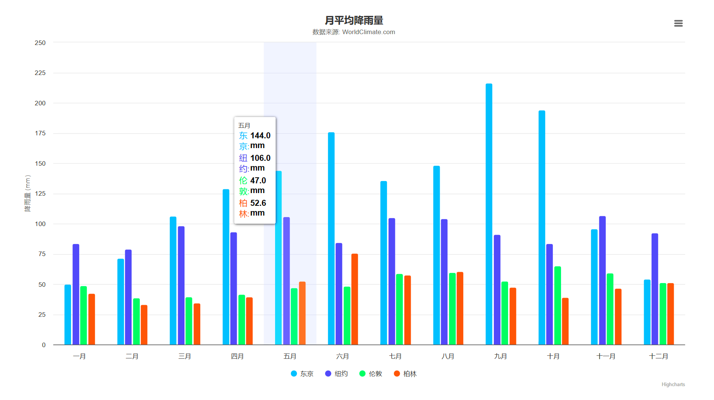


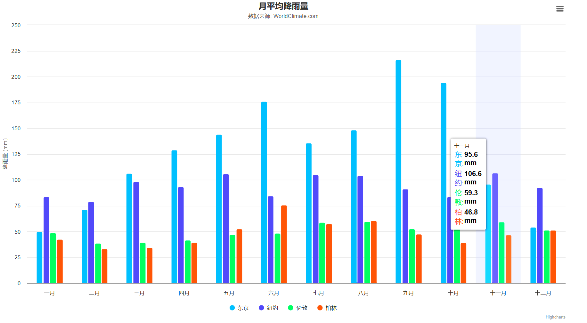


### 堆叠柱状图

```html
<html lang="en">
<head>
    <meta charset="UTF-8">
    <title>堆叠柱状图</title>

    <script src="./js/highcharts.js"></script>
    <script src="./js/exporting.js"></script>
    <script src="./js/series-label.js"></script>
    <script src="./js/zh_cn.js"></script>

</head>

<style>
    #container {
        width: 70vw;
        height: 70vh;
        position: absolute;
        top: 50%;
        left: 50%;
        transform: translate(-50%, -50%);
    }
</style>
<body>
<div id="container"></div>
<script>
    var chart = Highcharts.chart('container', {
        chart: {
            type: 'column'
        },
        title: {
            text: '堆叠柱状图'
        },
        xAxis: {
            categories: ['苹果', '橘子', '梨', '葡萄', '香蕉']
        },
        yAxis: {
            min: 0,
            title: {
                text: '水果消费总量'
            }
        },
        legend: {
            /* 图例显示顺序反转
             * 这是因为堆叠的顺序默认是反转的，可以设置
             * yAxis.reversedStacks = false 来达到类似的效果
             */
            reversed: true
        },
        plotOptions: {
            series: {
                stacking: 'normal'
            }
        },
        series: [{
            name: '小张',
            data: [5, 3, 4, 7, 2]
        }, {
            name: '小彭',
            data: [2, 2, 3, 2, 1]
        }, {
            name: '小潘',
            data: [3, 4, 4, 2, 5]
        }]
    });
</script>

</body>
</html>
```


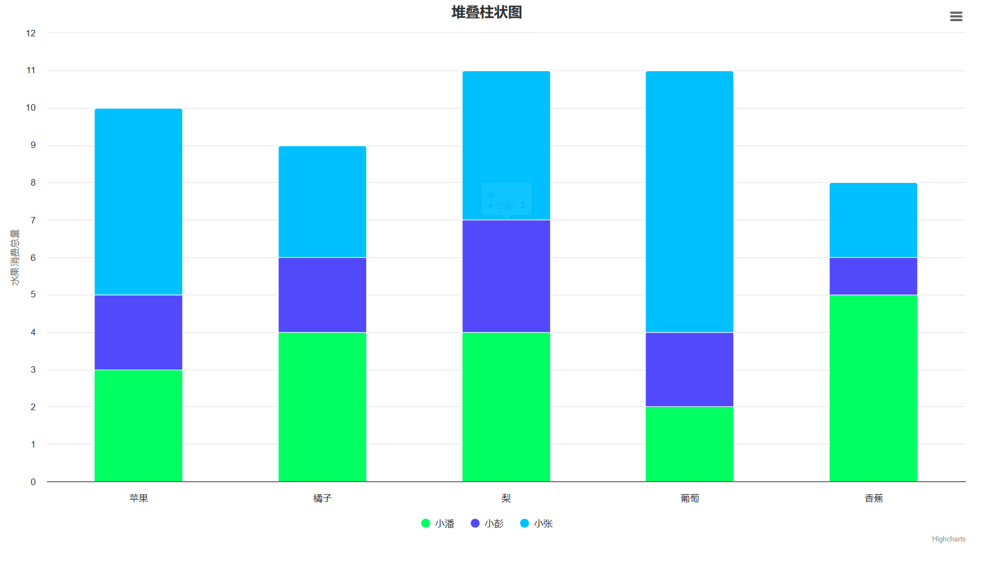


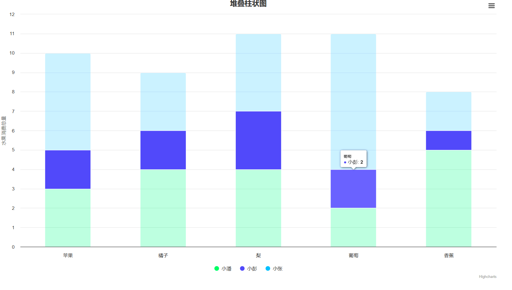


```html
<html lang="en">
<head>
    <meta charset="UTF-8">
    <title>堆叠柱状图</title>

    <script src="./js/highcharts.js"></script>
    <script src="./js/exporting.js"></script>
    <script src="./js/series-label.js"></script>
    <script src="./js/zh_cn.js"></script>

</head>

<style>
    #container {
        width: 70vw;
        height: 70vh;
        position: absolute;
        top: 50%;
        left: 50%;
        transform: translate(-50%, -50%);
    }
</style>
<body>
<div id="container"></div>
<script>
    var chart = Highcharts.chart('container', {
        chart: {
            type: 'column'
        },
        title: {
            text: '堆叠柱形图'
        },
        xAxis: {
            categories: ['苹果', '橘子', '梨', '葡萄', '香蕉']
        },
        yAxis: {
            min: 0,
            title: {
                text: '水果消费总量'
            },
            stackLabels: {  // 堆叠数据标签
                enabled: true,
                style: {
                    fontWeight: 'bold',
                    color: (Highcharts.theme && Highcharts.theme.textColor) || 'gray'
                }
            }
        },
        legend: {
            align: 'right',
            x: -30,
            verticalAlign: 'top',
            y: 25,
            floating: true,
            backgroundColor: (Highcharts.theme && Highcharts.theme.background2) || 'white',
            borderColor: '#CCC',
            borderWidth: 1,
            shadow: false
        },
        tooltip: {
            formatter: function () {
                return '<b>' + this.x + '</b><br/>' +
                    this.series.name + ': ' + this.y + '<br/>' +
                    '总量: ' + this.point.stackTotal;
            }
        },
        plotOptions: {
            column: {
                stacking: 'normal',
                dataLabels: {
                    enabled: true,
                    color: (Highcharts.theme && Highcharts.theme.dataLabelsColor) || 'white',
                    style: {
                        // 如果不需要数据标签阴影，可以将 textOutline 设置为 'none'
                        textOutline: '1px 1px black'
                    }
                }
            }
        },
        series: [{
            name: '小张',
            data: [5, 3, 4, 7, 2]
        }, {
            name: '小彭',
            data: [2, 2, 3, 2, 1]
        }, {
            name: '小潘',
            data: [3, 4, 4, 2, 5]
        }]
    });
</script>

</body>
</html>
```


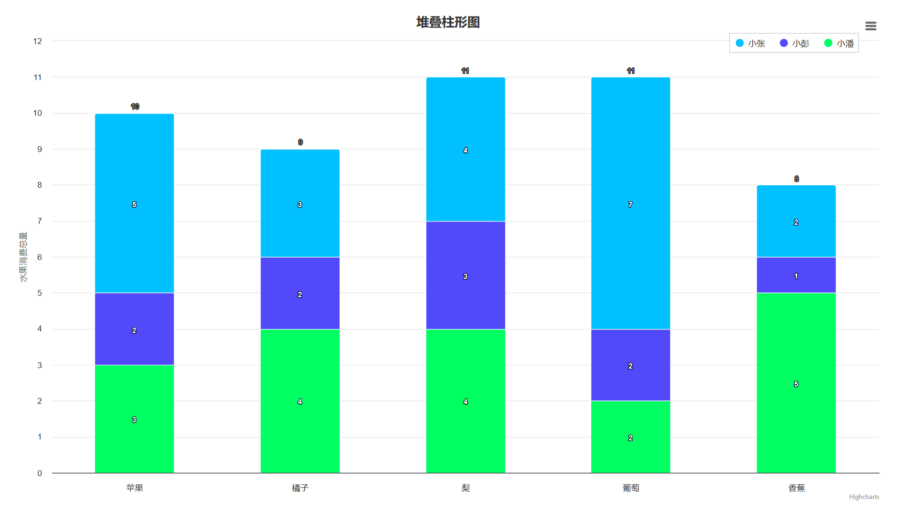


### 动态更新数据

```html
<html lang="en">
<head>
    <meta charSet="UTF-8">
    <title>动态更新数据</title>

    <script src="./js/highcharts.js"></script>
    <script src="./js/exporting.js"></script>
    <script src="./js/series-label.js"></script>
    <script src="./js/zh_cn.js"></script>

</head>

<style>
    #container {
        width: 70vw;
        height: 70vh;
        position: absolute;
        top: 50%;
        left: 50%;
        transform: translate(-50%, -50%);
    }
</style>
<body>
<div id="container"></div>
<script>
    var chart = Highcharts.chart('container', {
        chart: {
            type: 'column'
        },
        title: {
            text: '堆叠柱形图'
        },
        xAxis: {
            categories: ['苹果', '橘子', '梨', '葡萄', '香蕉']
        },
        yAxis: {
            min: 0,
            title: {
                text: '水果消费总量'
            },
            stackLabels: {  // 堆叠数据标签
                enabled: true,
                style: {
                    fontWeight: 'bold',
                    color: (Highcharts.theme && Highcharts.theme.textColor) || 'gray'
                }
            }
        },
        legend: {
            align: 'right',
            x: -30,
            verticalAlign: 'top',
            y: 25,
            floating: true,
            backgroundColor: (Highcharts.theme && Highcharts.theme.background2) || 'white',
            borderColor: '#CCC',
            borderWidth: 1,
            shadow: false
        },
        tooltip: {
            formatter: function ()
            {
                return '<b>' + this.x + '</b><br/>' +
                    this.series.name + ': ' + this.y + '<br/>' +
                    '总量: ' + this.point.stackTotal;
            }
        },
        plotOptions: {
            column: {
                stacking: 'normal',
                dataLabels: {
                    enabled: true,
                    color: (Highcharts.theme && Highcharts.theme.dataLabelsColor) || 'white',
                    style: {
                        // 如果不需要数据标签阴影，可以将 textOutline 设置为 'none'
                        textOutline: '1px 1px black'
                    }
                }
            }
        },
        series: [{
            name: '小张',
            data: [5, 3, 4, 7, 2]
        }, {
            name: '小彭',
            data: [2, 2, 3, 2, 1]
        }, {
            name: '小潘',
            data: [3, 4, 4, 2, 5]
        }]
    });

    var a = 4;
    var b = 1;

    window.setInterval(() =>
    {
        const series = chart.series

        series[0].updateData([5, 3, a++, 7, 2])
        series[1].updateData([2, 2, 3, 2, b++])

        chart.redraw();
    }, 3000)

</script>

</body>
</html>
```


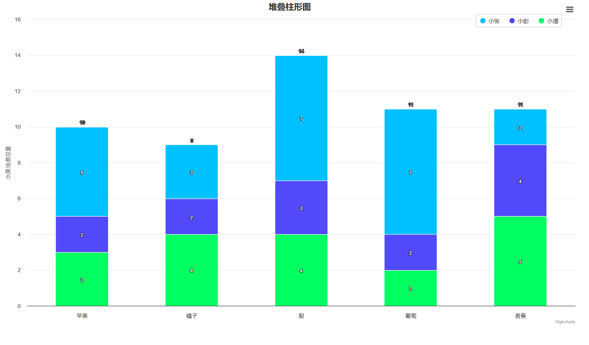


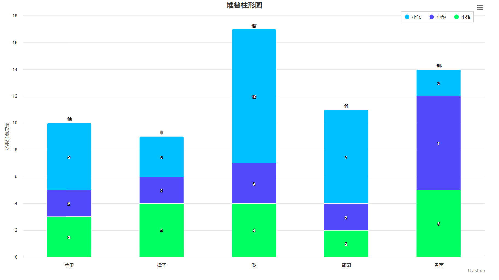


### 百分比堆叠柱状图

```html
<html lang="en">
<head>
    <meta charSet="UTF-8">
    <title>百分比堆叠柱状图</title>

    <script src="./js/highcharts.js"></script>
    <script src="./js/exporting.js"></script>
    <script src="./js/series-label.js"></script>
    <script src="./js/zh_cn.js"></script>

</head>

<style>
    #container {
        width: 70vw;
        height: 70vh;
        position: absolute;
        top: 50%;
        left: 50%;
        transform: translate(-50%, -50%);
    }
</style>
<body>
<div id="container"></div>
<script>
    var chart = Highcharts.chart('container', {
        chart: {
            type: 'column'
        },
        title: {
            text: '百分比堆叠柱形图'
        },
        xAxis: {
            categories: ['苹果', '橘子', '梨', '葡萄', '香蕉']
        },
        yAxis: {
            min: 0,
            title: {
                text: '水果消费总量'
            }
        },
        tooltip: {
            pointFormat: '<span style="color:{series.color}">{series.name}</span>: <b>{point.y}</b>' +
                '({point.percentage:.0f}%)<br/>',
            //:.0f 表示保留 0 位小数，详见教程：https://www.hcharts.cn/docs/basic-labels-string-formatting
            shared: true
        },
        plotOptions: {
            column: {
                stacking: 'percent'
            }
        },
        series: [{
            name: '小张',
            data: [5, 3, 4, 7, 2]
        }, {
            name: '小彭',
            data: [2, 2, 3, 2, 1]
        }, {
            name: '小潘',
            data: [3, 4, 4, 2, 5]
        }]
    });

</script>

</body>
</html>
```


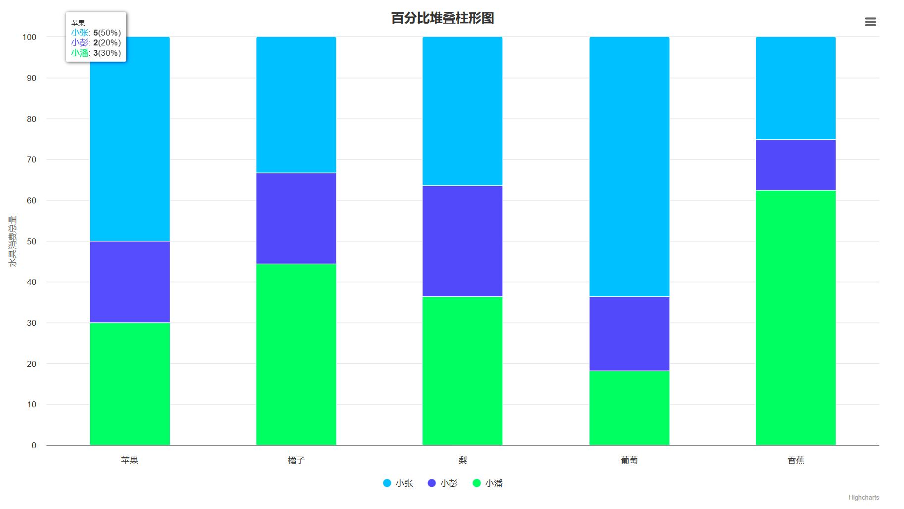


